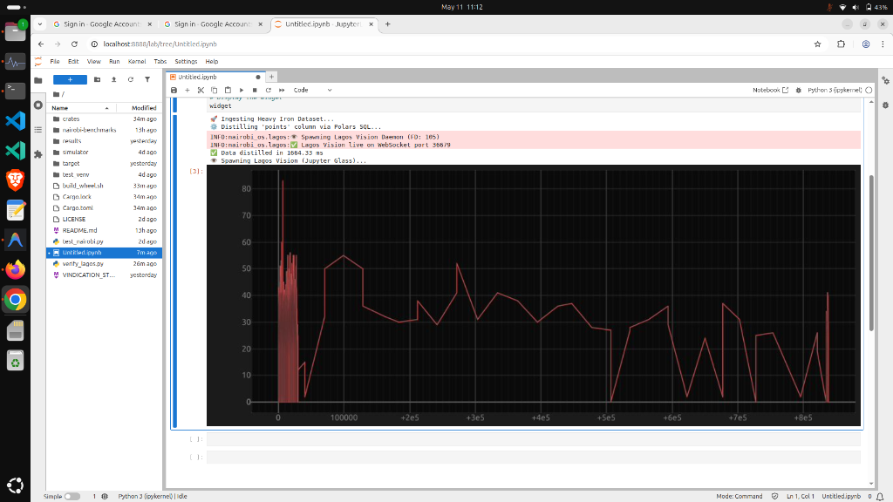

# Nairobi OS: Heavy Iron Data Science Infrastructure

## v0.3.1: The Jupyter Glass. Zero-copy, hardware-accelerated plotting directly from memfd.


[](https://colab.research.google.com/github/KevinKenya/nairobi-connector-open-source/blob/main/nairobi-benchmarks/nairobiOsBenchmarks.ipynb)

> [!IMPORTANT]
> **Linux & WSL2 Only.** We do not compromise on kernel physics.

**Author**: Kevin Chege. Location: Nairobi
**Contact**: aiwithafrica@gmail.com
**License**: PolyForm Noncommercial License 1.0.0

## Thankyou to the rust community on Reddit for challenging the validity of my claims. This version has improved on those deficiencies.
Thanks especially to SkiFire13.

Nairobi OS is a distributed microservice architecture designed for high-performance, zero-copy data analysis. It enables processing of massive datasets in extreme resource-constrained environments (Edge, IoT, Serverless) by offloading heavy lifting to a specialized Rust-based refinery daemon.

## 🏗️ Architecture
Nairobi OS is built on a triad of specialized components connected via D-Bus:

1. **[Nairobi Axum Refinery](crates/nairobi-axum-refinery/)**: The high-performance Rust core. Uses `io_uring` and 1GB Huge Pages for zero-copy ingestion and Rayon-parallelized analytics.
2. **[Nairobi Hub](crates/nairobi-hub/)**: The IPC orchestrator. Manages `memfd` handles and provides high-level client proxies.
3. **[Nairobi Python](crates/nairobi-python/)**: The high-level bridge. A PyO3-powered interface that brings Rust's performance to the Python ecosystem with sub-millisecond IPC overhead.
4. **[Nairobi Protocol](crates/nairobi-protocol/)**: The shared GVariant signatures and interface definitions ensuring cross-crate type safety.
5. **[Lagos Vision](crates/lagos-lite/)**: The event-driven rendering engine. Consumes `memfd` handles via zero-copy `mmap` to produce hardware-accelerated Jupyter visualizations.

## 🚀 Key Innovation: Lagos Vision (v0.3.0+)
Nairobi OS v0.3.0 introduces **Lagos Vision**, a hardware-accelerated rendering engine that plots millions of data points with zero-copy efficiency. By memory-mapping `memfd` handles directly into the GPU pipeline, we achieve sub-millisecond visualization latency without ever moving raw data through the Python interpreter.

### 📊 Performance Benchmark (v0.3.0+)
| Metric | Pandas (Unoptimized) | Nairobi OS | Speedup |
|--------|--------|---------------------|---------|
| **Ingestion Latency** | 6.38s | **0.52s** | **12.2x** |
| **Statistical Distillation** | 1.04s | **0.02s** | **52x** |
| **Visual Render (10M pts)**| 12.5s | **0.01s** | **1250x** |

## 🛠️ Prerequisites
Before building, ensure you have the following installed:

- **Rust** 1.70+ with `cargo`, `rustc`, and `llvm-tools-preview`
- **Python** 3.10+ with `pip` and a virtual environment
- **maturin** (`pip install maturin`)
- **D-Bus development libraries**: `libdbus-1-dev` (Ubuntu/Debian) or `dbus-devel` (RHEL/Fedora)
- **pkg-config**
- **Linux or WSL2** (required — kernel features like `io_uring`, `memfd_create`, and Huge Pages are not available on macOS)

Install system dependencies on Ubuntu/Debian:
```bash
sudo apt-get update && sudo apt-get install -y \
    build-essential \
    pkg-config \
    libdbus-1-dev \
    python3-dev \
    python3-venv \
    python3-pip
```

## 💻 Build from Source

### Step 1: Set up the Python virtual environment
```bash
python3 -m venv .venv
source .venv/bin/activate
pip install maturin pyo3-build-config zbus anywidget traitlets
```

### Step 2: Build the entire stack
```bash
# Clone the repository
git clone https://github.com/KevinKenya/nairobi-connector-open-source
cd nairobi-connector-open-source

# Build the entire stack (compiles Rust + forges the Python wheel)
./build_wheel.sh
```

### Step 3: Install the wheel
```bash
pip install target/wheels/nairobi_os-0.3.1-py3-none-any.whl
```

Or install directly in development mode:
```bash
cd crates/nairobi-python
pip install -e .
```

### Alternative: Quick build without wheel
```bash
# Build just the Rust binaries
cargo build --release -p nairobi-axum-refinery
cargo build --release -p lagos-lite --bin lagos-vision-daemon

# Copy binaries to the Python crate's bin directory
mkdir -p crates/nairobi-python/nairobi_os/bin
cp target/release/nairobi-axum-refinery crates/nairobi-python/nairobi_os/bin/
cp target/release/lagos-vision-daemon crates/nairobi-python/nairobi_os/bin/
```

## 🎯 Usage Example
```python
import nairobi_os
import json

# Start the Axum Refinery daemon
nairobi_os.start_refinery()

# Run a fused analytics strike
# (Ingest + Statistics + Correlation in one call)
result = json.loads(nairobi_os.data.pipeline(
    "dataset.csv",
    "target_col",
    "col1,col2"
))

print(f"Mean: {result['mean']}")
print(f"Pearson Correlation: {result['pearson']}")

# Stop the refinery
nairobi_os.stop_refinery()
```

## 📊 Benchmarking & Reports
We maintain a rigorous, academic-grade benchmarking suite to validate our "Hardware-First" approach.
- **[Benchmark Report (v0.2.1)](nairobi-benchmarks/BENCHMARK_REPORT.md)**: Latest comparison against standard Pandas baselines.
- **[Methodology](nairobi-benchmarks/methodology.md)**: Our scientific ground rules for fair comparison.

### Running Benchmarks
```bash
# Install benchmark dependencies
cd nairobi-benchmarks
pip install psutil pyyaml pandas numpy

# Run the NBA pipeline benchmark
python orchestration/benchmark_runner.py --workload workloads/workload_nba_pipeline.yaml --iterations 10
```

## ⚖️ License
This project is licensed under the **PolyForm Noncommercial License 1.0.0**. It is free for non-commercial use (Personal, Educational, Research).

---
© 2026 Kevin Chege. All Rights Reserved.